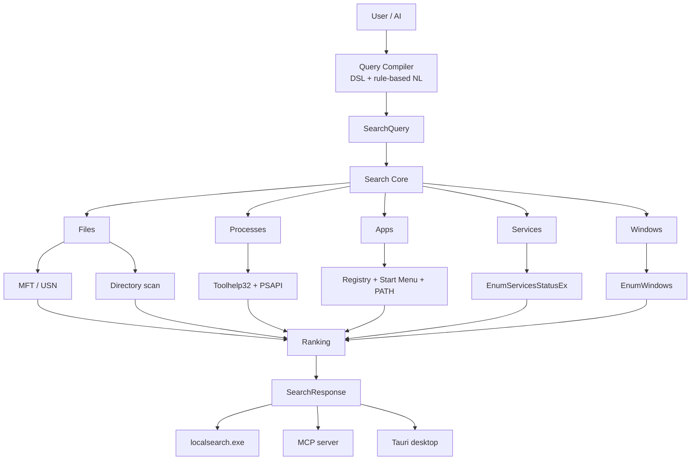

# Architecture

## The one-sentence version

Natural language goes in, a deterministic query comes out, and a Rust search
core answers it from local data — no model, no network and no database on the
hot path.

## The pipeline



## Why `AI != Search Engine`

The tempting design is to hand the whole question to a model: embed the query,
embed the file names, ask a vector database for the nearest few. It fails for
the thing a desktop search has to be good at.

* **It is not deterministic.** The same query has to return the same list in the
  same order, or the muscle memory you build after a week of use is worthless.
* **It is not instant.** A local embedding pass plus a vector lookup is tens to
  hundreds of milliseconds before you have even started ranking.
* **It is not auditable.** "Why is this file above that one?" has to have an
  answer a person can read. A cosine similarity is not an answer.
* **It is not private by construction.** The moment a model is on the query
  path, the question "could this call out to the network?" is back.

So the model, if there is one, goes **here**:

```text
User  ──▶ Query Compiler ──▶ SearchQuery ──▶ Search Core ──▶ Results
              ▲
              │
     an AI may replace this box
```

The compiler's whole job is translation: "最近的 pdf" becomes
`type:file ext:pdf sort:modified-desc`. Retrieval is untouched by it. Ship the
MVP with a rule-based compiler (this repository does), and a future provider can
swap in a model behind the same `QueryCompiler` trait without the engine
noticing.

## Crate boundaries

```text
apps/desktop ────────────────────────────────┐
crates/search-cli ─────┐                     │
crates/search-mcp ─────┼──▶ crates/search-daemon ──▶ crates/search-core
                       │            │                    ▲
                       │            ├─▶ crates/query-dsl ┘
                       │            ├─▶ crates/ranking   ┘
                       │            └─▶ crates/windows-{files,processes,apps,services,windows}
                       │
                       └── all three call exactly one `SearchService`
```

| crate               | responsibility                                          | must not know about          |
|---------------------|---------------------------------------------------------|------------------------------|
| `search-core`       | entity/query/result model, engine, fuzzy matcher        | Win32, Tauri, CLI            |
| `query-dsl`         | DSL parser, rule-based NL compiler                      | the OS, ranking              |
| `ranking`           | heuristic scoring, usage memory                         | providers, presentation      |
| `windows-files`     | index backends, persistence                             | other domains                |
| `windows-processes` | process snapshots                                       | other domains                |
| `windows-apps`      | application discovery                                   | other domains                |
| `windows-services`  | service snapshots (read-only)                           | other domains                |
| `windows-windows`   | window snapshots                                        | other domains                |
| `search-daemon`     | composition root, settings, actions                     | UI frameworks                |
| `search-cli`        | `localsearch.exe`                                       | search logic                 |
| `search-mcp`        | MCP/JSON-RPC transport, tool schemas                    | search logic                 |
| `apps/desktop`      | Tauri shell, React UI, i18n                             | search logic                 |

The rule that keeps this honest: **if two front ends would need the same
decision, that decision belongs in `search-daemon` or below it.** Ranking,
filtering, compiling, opening results and terminating processes each exist
exactly once.

## The `EntityProvider` boundary

```rust
pub trait EntityProvider: Send + Sync + Debug {
    fn name(&self) -> &'static str;
    fn scope(&self) -> SnapshotScope;
    fn entity_types(&self) -> &'static [EntityType];
    fn collect(&self, query: &SearchQuery) -> Result<Vec<LocalEntity>>;
    fn stats(&self) -> ProviderStats;
    fn refresh(&self) -> Result<()>;
}
```

A provider is the only place that knows how to read one domain out of the
operating system. It returns normalised entities and nothing else — no ranking,
no formatting, no presentation concerns. Adding a domain means adding one
provider; it does not mean touching the engine, the CLI, the MCP server or the
UI's search logic.

## The ranker boundary

```rust
pub trait Ranker: Send + Sync + Debug {
    fn score(&self, query: &SearchQuery, entity: &LocalEntity) -> Option<RankedMatch>;
}
```

`Some` means "this answers the text"; `None` drops the candidate. The bundled
`HeuristicRanker` sums named, weighted components
(`exact_match` 100, `prefix_match` 60, `filename_match` 40, `token_match` 30,
`path_match` 20, `fuzzy_match` 10, `usage_frequency` 8, `recency` 5, plus a
per-type preference), which is what makes `--explain` able to show its work.

## File indexing

```text
                 ┌──────────────────────────────┐
   \\.\C:  ─────▶ │ mft::build                   │ ─┐
   FSCTL_ENUM_USN_DATA │  initials index        │  │
                 └──────────────────────────────┘  │
                                                   ├──▶ store::FileStore ──▶ search
                 ┌──────────────────────────────┐  │
   directories ─▶ │ scan::build_store            │ ─┘
                 └──────────────────────────────┘
```

| backend   | needs admin | file sizes | warm start                       |
|-----------|-------------|------------|----------------------------------|
| `scan`    | no          | yes        | loads the persisted cache        |
| `mft-usn` | yes         | no         | replays the USN change journal    |

`auto` prefers `mft-usn` when the volume handle can be opened and silently falls
back to `scan`, so the provider always works. See
[`crates/windows-files/src/mft.rs`](../crates/windows-files/src/mft.rs) for why
the MFT path cannot report sizes without per-file NTFS attribute parsing.

### Memory

Entries live in a string arena plus fixed-size records rather than one
allocation-heavy struct per file:

```text
1_000_000 rows  ×  48 B  =  48 MB
names + directories      ≈  20 MB
------------------------------------
                           ≈ 68 MB
```

`store::FileStore::memory_bytes()` reports the real figure in Settings → Index,
so the README never has to guess.

### Persistence

`PersistedIndex` is MessagePack written to a temporary file and then renamed, so
an interrupted save can never leave a half-written cache. A version mismatch is
not an error: the cache is ignored and rebuilt.

## Live snapshots

Processes, windows and services are never persisted. A snapshot of "now" is the
only thing that makes sense for them, and a stale one is worse than none.

| domain    | API                              | caching                              |
|-----------|----------------------------------|--------------------------------------|
| processes | `CreateToolhelp32Snapshot` + PSAPI | 250 ms, resolved in parallel         |
| windows   | `EnumWindows`                     | 250 ms                                |
| services  | `EnumServicesStatusEx`            | 5 s, config resolved only where needed |
| apps      | registry + Start Menu + `PATH`    | 5 min (installed apps rarely change)  |

## Error model

```text
SearchError   IndexError   PlatformError   PermissionError
        \           |             |              /
         +----------+------+------+-------------+
                           │
                        LceError
                           │
        ┌──────────────────┼──────────────────┐
        │                  │                  │
   code() string      hint() (English)   Display (developer)
        │
   i18n key `error.<code>`
```

The UI never renders `OsError(5)`. It renders
`error.volume-access-denied` → "无法访问该卷。可能需要管理员权限。", and the
original error goes to the log.

## Threading

* Providers are `Send + Sync`; the engine fans out serially but each provider is
  cheap once warm.
* `FileProvider::rebuild` is the only genuinely long operation. It runs on a
  Tauri blocking thread from the UI and as a plain call from the CLI.
* Process detail resolution is chunked across up to eight OS threads, which is
  what turns ~30 ms of serial syscalls into single digits.
* There is no polling loop anywhere. Idle CPU is zero because idle means "no
  thread is doing anything".

## Roadmap

| area                   | next step                                                        |
|------------------------|------------------------------------------------------------------|
| MSIX/Appx discovery    | read `AppModel\Repository` instead of relying on Start Menu links |
| MFT file sizes         | parse the `$DATA` attribute from `FSCTL_GET_NTFS_FILE_RECORD`     |
| Event-driven file index| subscribe to the USN journal instead of replaying it on demand    |
| Frameless palette mode | optional chromeless window with a custom drag handle              |
| AI query compiler      | a second `QueryCompiler` implementation, opt-in and off by default|